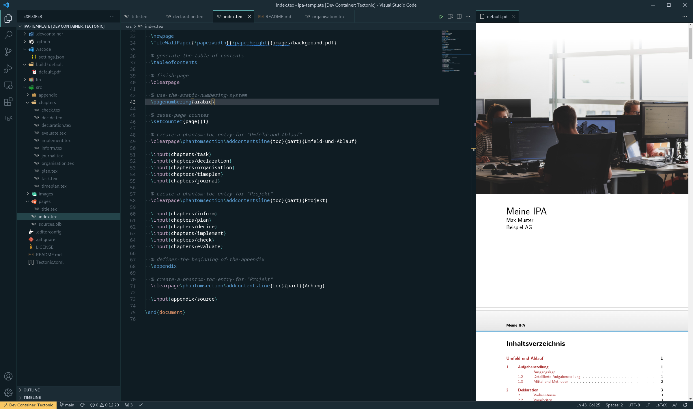

# IPA Vorlage

Informatiklernende (EFZ) schliessen Ihre Ausbildung mit einer individuellen praktischen Abschlussprüfung (IPA) ab. Dabei sind umfangreiche Dokumentationsarbeiten notwendig. Diese Vorlage hilft dabei sich auf die Inhalte und Realisierung konzentrieren zu können und keine Inhalte zu vergessen. Mit dieser Vorlage ist es möglich, innert Minuten mit der produktiven Arbeit am IPA-Bericht zu beginnen.

## Funktionen

- Moderne TeX/LaTeX Umgebung [Tectonic](https://tectonic-typesetting.github.io/en-US/)
- Visual Studio Code mit [Remote Containers](https://marketplace.visualstudio.com/items?itemName=ms-vscode-remote.remote-containers)
- Continuous Integration und Continuous Delivery mit Github Actions
- Integrierte Vorlage für den IPA Bericht
- Konfigurierbar über Variabeln in `src/index.tex`

## Loslegen

1. Repository klonen
1. Ordner in Visual Studio Code mit installierter Erweiterung [Remote Containers](https://marketplace.visualstudio.com/items?itemName=ms-vscode-remote.remote-containers) öffnen
1. `src/index.tex` öffnen und <kbd>CTRL</kbd>+<kbd>ALT</kbd>+<kbd>b</kbd> oder über <kbd>CTRL</kbd>+<kbd>P</kbd> das Kommando `LaTeX Workshop: Build LaTeX project` aufrufen
1. `build/default/default.pdf` öffnen
1. Dokument ändern, die Vorschau des PDFs aktualisiert sich fortlaufend
1. Variabeln in `src/index.tex` anpassen

## Kriteriennachweis

Dieser Abschnitt bezieht sich auf den [Standardkritierenkatalog](https://pk19.ch/wp-content/uploads/2021/11/Kriterienkatalog-Standardkriterien_2022.pdf) und dessen [Leitfaden](https://pk19.ch/wp-content/uploads/2021/11/QV-Leitfaden_2022.pdf). Unterhalb wird ein Bezug zwischen den Kriterien und dieser Vorlage hergestellt.

### Teil A

| Kriterium                                                        | Referenz | Bemerkung |
| ---------------------------------------------------------------- | -------- | --------- |
| A1: Projektmanagement und Planung                                |          |           |
| A2: Wissensbeschaffung                                           |          |           |
| A3: Zeitplan                                                     |          |           |
| A4: Konzeptionelle Umsetzung                                     |          |           |
| A5: Projektumfeld: Systemgrenzen / Schnittstellen zur Aussenwelt |          |           |
| A6: Testkonzept                                                  |          |           |
| A7: Leistungsfähigkeit                                           |          |           |
| A8: Selbständiges Arbeiten                                       |          |           |
| A9: Fachkenntnisse und Anwendungskompetenz                       |          |           |
| A10: Anwendung der Fachsprache                                   |          |           |
| A11: Arbeits- und Fachmethodik                                   |          |           |
| A12: Organisation der Arbeitsergebnisse                          |          |           |
| A13: IPA-Erfüllungsgrad                                          |          |           |

### Teil B

| Kriterium                                                          | Referenz | Bemerkung |
| ------------------------------------------------------------------ | -------- | --------- |
| B1: Kurzfassung des IPA-Berichtes                                  |          |           |
| B2: Führung des Arbeitsjournals                                    |          |           |
| B3: Reflexionsfähigkeit                                            |          |           |
| B4: Gliederung                                                     |          |           |
| B5: Prägnanz                                                       |          |           |
| B6: Formale Vollständigkeit des IPA-Berichts                       |          |           |
| B7: Sprachlicher Ausdruck und Stil / Rechtschreibung und Grammatik |          |           |
| B8: Darstellung                                                    |          |           |
| B9: Grafiken, Bilder, Diagramme und Tabellen                       |          |           |
| B10: Durchführung und Auswertung der Tests                         |          |           |

## Referenzen

[1]: https://pk19.ch/wp-content/uploads/2021/11/Kriterienkatalog-Standardkriterien_2022.pdf
[2]: https://pk19.ch/wp-content/uploads/2021/11/QV-Leitfaden_2022.pdf